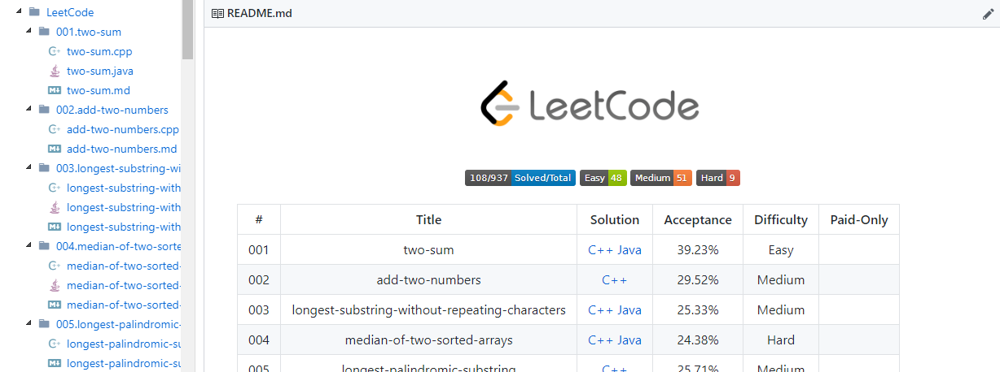
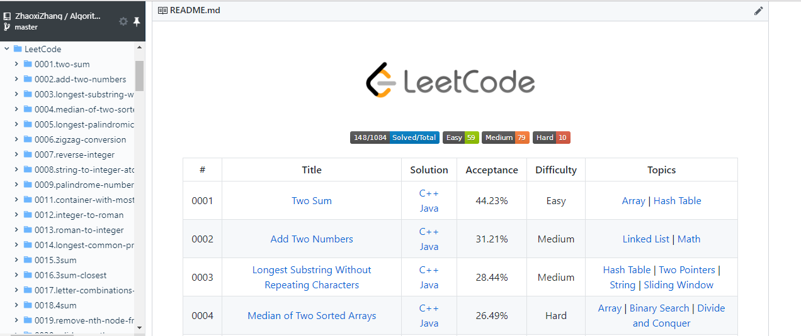
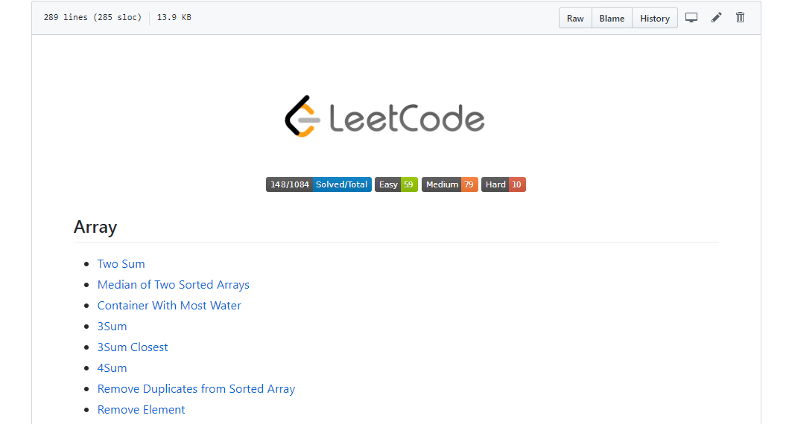

# LeetCodeCrawler

## 概述
一个爬取 LeetCode 题目内容以及提交的AC代码的工具，并支持生成相应的 README.md 文件，美化你的 LeetCode 仓库的README。

本项目启发自[leetcode-spider](https://github.com/Ma63d/leetcode-spider),其使用 JavaScript 编写，因不再继续维护，且本人暂时对 JavaScript 未过多了解，因此用 Java 重实现了爬取。

## 使用
下载[LeetCodeCrawler.jar](https://github.com/ZhaoxiZhang/LeetCodeCrawler/raw/master/LeetCodeCrawler.jar)到本地

建立好如下`config.json`文件（可直接对 repo 的`config.json`进行更改)，`config.json`文件需与`LeetCodeCrawler.jar`放置于同一目录下：
```
{
    "username": "leetcode@leetcode",
    "password": "leetcode",
    "language": ["cpp", "java"],
    "outputDir": "."
}
```
- `username`和`password`对应你的 LeetCode 账号和密码
- `language`对应于你在 LeetCode 刷题使用的编程语言，可多选，选填字段如下（**请严格按照如下字段填写**）：
    - cpp
    - java
    - c
    - csharp
    - javascript
    - python
    - python3
    - ruby
    - swift
    - golang
    - scala
    - kotlin
- `outputDir`字段表示你希望存放源码文件的目录,默认为`.`，即当前目录

运行`java -jar LeetCodeCrawler.jar`

## 效果
具体效果以及爬取的具体数据可参看我的repo：[LeetCode](https://github.com/ZhaoxiZhang/Algorithm/tree/master/LeetCode), 自己使用的这个工具爬取的 LeetCode 题目和提交的源码。



