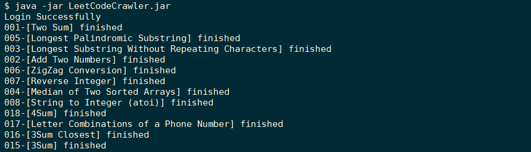

# LeetCodeCrawler

## Overview
A tool for crawling the description and accepted submitted code of problems on the [LeetCode](https://leetcode.com/) and [LeetCode-Cn](https://leetcode-cn.com/) website. The tool supports to generate README.md and Topics.md files to beautify your README of LeetCode repository.

This project is inspired by [leetcode-spider](https://github.com/Ma63d/leetcode-spider), which is written in JavaScript. It is no longer maintained, and I don't know much about JavaScript for a while, thus I implement crawling with Java.

## Usage
For the [LeetCode](https://leetcode.com/) website, download [LeetCodeCrawler.jar](https://github.com/ZhaoxiZhang/LeetCodeCrawler/blob/master/LeetCodeCrawler/LeetCodeCrawler.jar) to your local.

For the [LeetCode-Cn](https://leetcode-cn.com/) website, download [Cn-LeetCodeCrawler](https://github.com/ZhaoxiZhang/LeetCodeCrawler/blob/master/Cn-LeetCodeCrawler/Cn-LeetCodeCrawler.jar) to your local.

Create the `config.json` file as shown below(you can modify the `config.json` in the repo directly), the `config.json` file should be placed in the same directory as `LeetCodeCrawler.jar` or `Cn-LeetCodeCrawler.jar`:
```
{
    "username": "leetcode@leetcode",
    "password": "leetcode",
    "language": ["cpp", "java"],
    "outputDir": "."
}
```
- `username` and `password` correspond to the account and password on the website.
- `language` corresponds to the programming language you use in the website. You can select multiple fields, the optional fields are shown as follow(**Please fill in the corresponding fields strictly as follow**):
    - cpp
    - java
    - c
    - csharp
    - javascript
    - python
    - python3
    - ruby
    - swift
    - golang
    - scala
    - kotlin
- The `outputDir` field indicates the directory where you want to store the resources crawled by the tool. The default is `.`, which means the current directory.

run command `java -jar LeetCodeCrawler.jar` or `java -jar Cn-LeetCodeCrawler.jar`

## Result
you can see the result for crawling in my repository：[LeetCode](https://github.com/ZhaoxiZhang/Algorithm/tree/master/LeetCode).



